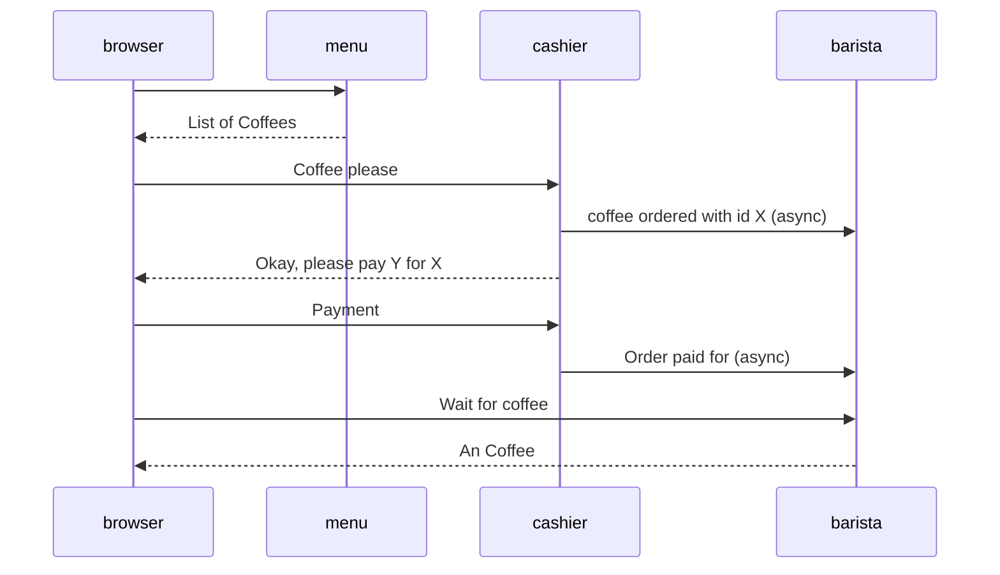

# Rust coffee shop thing

[Mermaid diagram](https://mermaidjs.github.io/mermaid-live-editor/)

```mermaid
sequenceDiagram
    browser ->> menu:
    menu -->> browser: List of Coffees
    browser ->> cashier: Coffee please
    cashier ->> barista: coffee ordered with id X (async)
    cashier -->> browser: Okay, please pay Y for X
    browser ->> cashier: Payment
    cashier ->> barista: Order paid for (async)
    browser ->> barista: Wait for coffee
    barista -->> browser: An Coffee
```